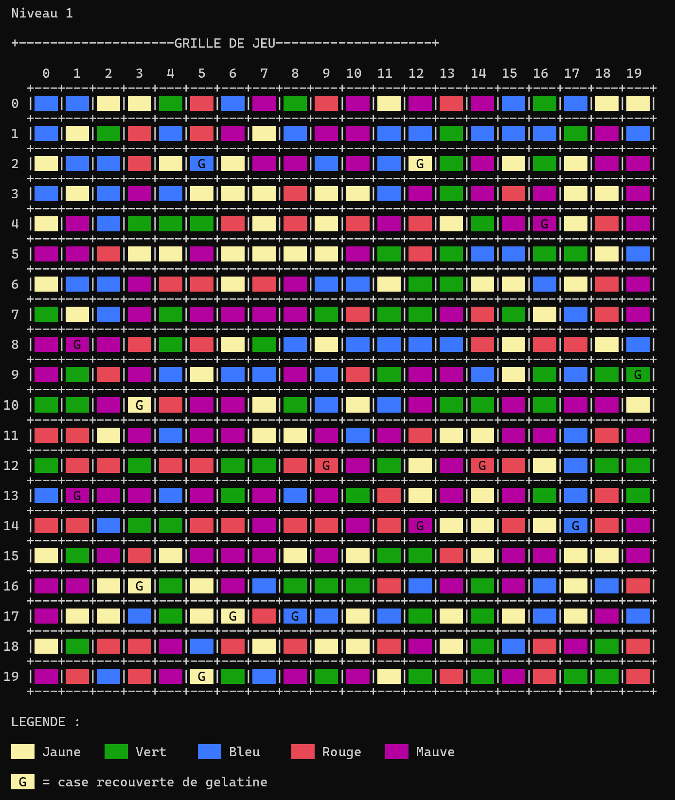

# Candy Crush – Console Edition

A Candy Crush–style match-3 game running in the Windows console, written in **C**.

   

## ✨ Features
- 20 × 20 game grid with 5 candy colors displayed using **ANSI colors**
- Swap two candies by entering their row and column
- **Match detection** of aligned candies of the same color
- **Jelly tiles** (G) to clear to complete a level
- Several levels

## 🏗️ Technical highlights
- **Circular FIFO queue** used to manage the game logic
- Code split into modules: grid (`Matrice`), display (`Affichage`), queue (`Queue`), cells and actions
- Full **test plan** covering the game rules
- Built under strict coding constraints set by the course: no `exit()`, `break`, `switch/case` or `sizeof()`

## 🛠️ Tech stack
- Language: C (source files use the `.cpp` extension to compile with Visual Studio)
- IDE: Visual Studio
- Platform: Windows console

## 🚀 Run the project
1. Clone the repository
2. Open `CandyCrush.slnx` in a recent version of Visual Studio
3. Press **Ctrl + F5** to build and run

## 👤 Author
Chaimaa — [@ChaimaaBEI](https://github.com/ChaimaaBEI)

Built as part of the *Algorithmic principles and programming* course — Bachelor in Application Development.
